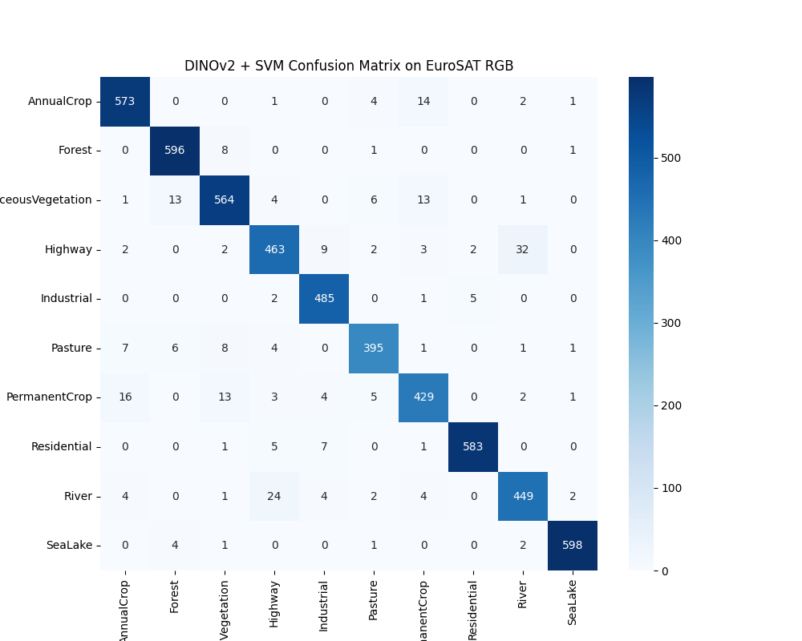

# Satellite / GIS Image Classifier (DINOv2 + SVM)

**Model**: Facebook AI's DINOv2 (ViT-S/14) + Linear SVM  
**Dataset**: [EuroSAT RGB](https://github.com/phelber/EuroSAT)  
**App**: [Streamlit Demo](https://dinov2-svm-satellite-classifier-jeyguhu5uhlnhmgtkqlrpe.streamlit.app/)

---

## Project Overview

This application enables real-time classification of satellite and remote sensing images into 10 land use/land cover categories using features extracted from a pretrained DINOv2 Vision Transformer (ViT-S/14) and a lightweight SVM classifier.

It is designed for practical use in Earth observation, urban planning, environmental monitoring, and GIS analysis workflows.

---

## Class Labels

- AnnualCrop
- Forest
- HerbaceousVegetation
- Highway
- Industrial
- Pasture
- PermanentCrop
- Residential
- River
- SeaLake

---

## Model Architecture

- **Backbone**: DINOv2 (`dinov2_vits14`) pretrained on LVD-142M
- **Feature Extractor**: TorchHub, inference only
- **Classifier**: Scikit-learn linear SVM (`C=1.0`)
- **Image Transformations**:
  - Resize: `244`
  - CenterCrop: `224`
  - Normalize: `[0.5], [0.5]`

---

## Deployment

**Compatible with Streamlit Cloud**

### Prerequisites

- Python 3.9–3.11
- GPU optional (DINOv2 supports CPU inference)
- Required files:
  - `app.py`
  - `dino_svm_classifier.pkl`
  - `class_names.npy`
  - `requirements.txt`

### Setup Instructions

```bash
git clone https://github.com/inayatrahimdev/satellite-dino-svm
cd satellite-dino-svm
pip install -r requirements.txt
streamlit run app.py
````

---

## Usage

1. Upload a `.jpg`, `.png`, or `.jpeg` satellite image.
2. The model runs DINOv2 on the image to extract visual embeddings.
3. Embeddings are passed to a trained SVM for classification.
4. Output shows predicted land cover class.

---

## Performance

* **Accuracy**: 95.09%
* **Macro F1-score**: 0.95
* **Model Size**: \~10.8MB (`.pkl`)
* **Inference Time**: <1 second (per image, CPU)

---

## Confusion Matrix

Below is the confusion matrix based on the test set:

<p align="center">
  
</p>

---

## Dataset Reference

* **Source**: EuroSAT RGB
* **License**: MIT License
* **Link**: [https://github.com/phelber/EuroSAT](https://github.com/phelber/EuroSAT)

---

## Future Enhancements

* Batch classification interface
* Top-k prediction confidence display
* FastAPI/Flask backend for deployment as REST service
* Comparison across multiple ViT backbones (Swin, DeiT, DINOv2-G)

---

## License

This repository is distributed under the MIT License. See `LICENSE` for full details.

---
## Contact

Website: https://www.inayatrahim.me  
LinkedIn: https://www.linkedin.com/in/inayat-rahim-b0655b29b  
GitHub: https://www.github.com/inayatrahimdev

---

